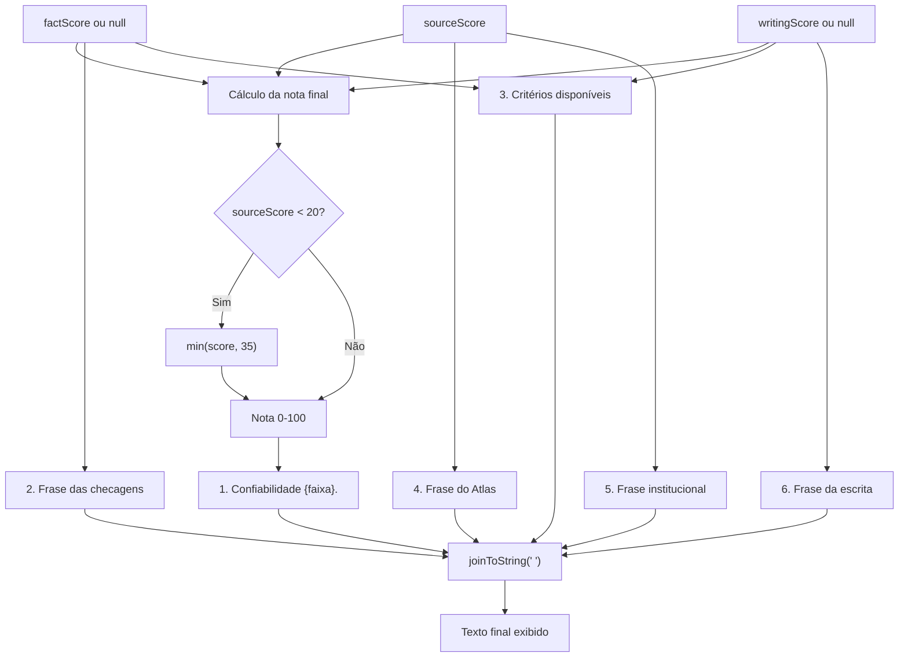

# Geração do Score Final e do Feedback

## 1. Cálculo da nota final

O app produz **três scores independentes**, combina-os em **uma nota de 0 a 100**, converte essa nota em uma **faixa de confiabilidade** e monta o **texto do feedback** por meio de frases fixas.

<p align="center">Tabela 1 - Pesos das métricas</p>

| Métrica | Score | Peso | Escala |
|---|---|---|---|
| Checagens Pré-Existentes | `factScore` | 0,65 | 0 a 1 (×100) |
| Credibilidade da Fonte | `sourceScore` | 0,20 | 0 a 100 |
| Estilo de Escrita | `writingScore` | 0,15 | 0 a 1 (×100) |

<p align="center">Fonte: Autoria de <a href="https://github.com/DaviNegreiros">Davi Negreiros</a> e <a href="https://github.com/bolzanMGB">Othavio Araújo Bolzan</a></p>

### 1.1 Fórmula com renormalização

Métricas ausentes **saem da conta** e os pesos restantes são **renormalizados**:

```text
availableWeights = 0,20
                 + (0,65 se factScore != null)
                 + (0,15 se writingScore != null)

score = ( 0,20 × sourceScore
        + 0,65 × factScore × 100    (se disponível)
        + 0,15 × writingScore × 100 (se disponível) )
        / availableWeights
```

### 1.2 Faixas de confiabilidade

<p align="center">Tabela 2 - Faixas de confiabilidade</p>

| Score | Faixa |
|---|---|
| > 85 | `alta` |
| > 70 e ≤ 85 | `média` |
| > 40 e ≤ 70 | `baixa` |
| ≤ 40 | `baixíssima` |

<p align="center">Fonte: Autoria de <a href="https://github.com/DaviNegreiros">Davi Negreiros</a> e <a href="https://github.com/bolzanMGB">Othavio Araújo Bolzan</a></p>

---

## 2. Composição do texto do feedback

O texto **não é gerado por LLM**. É montado por **frases fixas** escolhidas por condições booleanas e unidas com espaço (`details.joinToString(" ")`).

<p align="center"><b>Diagrama 1 - Do score ao texto exibido</b></p>



<p align="center">Fonte: Autoria de <a href="https://github.com/DaviNegreiros">Davi Negreiros</a> e <a href="https://github.com/bolzanMGB">Othavio Araújo Bolzan</a></p>

### 2.1 Ordem das frases

<p align="center">Tabela 3 - Ordem de montagem do texto</p>

| Ordem | Frase | Condição |
|---|---|---|
| 1 | `Confiabilidade {faixa}.` | Sempre |
| 2 | Frase sobre checagens | Sempre (uma das cinco) |
| 3 | Frase sobre critérios disponíveis | Depende de `factScore` e `writingScore` |
| 4 | Frase do Atlas | Sempre (encontrado ou não) |
| 5 | Frase institucional | Só se `.gov.br` ou institucional |
| 6 | Frase de escrita | Só se `writingScore == null` ou `< 0.5` |

<p align="center">Fonte: Autoria de <a href="https://github.com/DaviNegreiros">Davi Negreiros</a> e <a href="https://github.com/bolzanMGB">Othavio Araújo Bolzan</a></p>

### 2.2 Tabela de Frases

#### 2.2.1 Frase 1 — Faixa de confiabilidade

```text
"Confiabilidade alta."
"Confiabilidade média."
"Confiabilidade baixa."
"Confiabilidade baixíssima."
```

#### 2.2.2 Frase 2 — Checagens

<p align="center">Tabela 4 - Frase das checagens</p>

| Condição | Frase |
|---|---|
| `factScore == null` e houve afirmação equivalente sem veredito pontuado | Há fontes relacionadas, mas faltam dados para concluir. |
| `factScore == null` e sem afirmação equivalente | Não há checagem factual disponível. |
| Todos os `value > 0.5` | Há evidências favoráveis ao fato analisado. |
| Todos os `value < 0.5` | Há evidências contrárias ao fato analisado. |
| Qualquer outro caso (inclui `value = 0.5`) | Há evidências divergentes sobre o fato analisado. |

<p align="center">Fonte: Autoria de <a href="https://github.com/DaviNegreiros">Davi Negreiros</a> e <a href="https://github.com/bolzanMGB">Othavio Araújo Bolzan</a></p>

#### 2.2.3 Frase 3 — Critérios disponíveis

<p align="center">Tabela 5 - Frase dos critérios disponíveis</p>

| Condição | Frase |
|---|---|
| `factScore == null` e `writingScore != null` | A avaliação considera a credibilidade da fonte e o estilo de escrita; não confirma os fatos da notícia. |
| `factScore == null` e `writingScore == null` | A avaliação considera apenas a credibilidade da fonte e não confirma os fatos da notícia. |
| `factScore != null` e `availableWeights < 1.0` | A avaliação é parcial. |
| `factScore != null` e `availableWeights == 1.0` | (nenhuma frase) |

<p align="center">Fonte: Autoria de <a href="https://github.com/DaviNegreiros">Davi Negreiros</a> e <a href="https://github.com/bolzanMGB">Othavio Araújo Bolzan</a></p>

#### 2.2.4 Frase 4 — Atlas

<p align="center">Tabela 6 - Frase do Atlas</p>

| Condição | Frase |
|---|---|
| Domínio no Atlas | O veículo desta notícia foi encontrado no Atlas da Notícia. |
| Domínio fora do Atlas | O veículo desta notícia não pôde ser consultado na base de veículos. |

<p align="center">Fonte: Autoria de <a href="https://github.com/DaviNegreiros">Davi Negreiros</a> e <a href="https://github.com/bolzanMGB">Othavio Araújo Bolzan</a></p>

#### 2.2.5 Frase 5 — Institucional

<p align="center">Tabela 7 - Frase institucional</p>

| Condição | Frase |
|---|---|
| `.gov.br` | Ponto positivo: o site verificado é um site oficial do governo. |
| Outro institucional (`.edu.br`, `.jus.br`, `.leg.br`, `.mp.br`) | Ponto positivo: o site verificado possui um domínio institucional oficial. |
| Nenhum | (nenhuma frase) |

<p align="center">Fonte: Autoria de <a href="https://github.com/DaviNegreiros">Davi Negreiros</a> e <a href="https://github.com/bolzanMGB">Othavio Araújo Bolzan</a></p>

#### 2.2.6 Frase 6 — Escrita

<p align="center">Tabela 8 - Frase da escrita</p>

| Situação do `writingScore` | Frase |
|---|---|
| `null` | Análise da escrita indisponível. |
| `< 0.5` | A escrita apresentou sinais que exigem atenção. |
| `>= 0.5` | (nenhuma frase) |

<p align="center">Fonte: Autoria de <a href="https://github.com/DaviNegreiros">Davi Negreiros</a> e <a href="https://github.com/bolzanMGB">Othavio Araújo Bolzan</a></p>

---

## 3. Exemplo completo

Cenário do teste `AnalysisRulesTest.kt:16`: domínio governamental, sem checagem, `writingScore = 0.95`.

### 3.1 Etapas do cálculo

<p align="center">Tabela 9 - Etapas do cálculo da nota final</p>

| Etapa | Resultado |
|---|---|
| `sourceScore` | 100 (institucional) |
| `factScore` | `null` (sem checagem) |
| `writingScore` | 0,95 |
| `availableWeights` | 0,20 + 0,15 = **0,35** |
| Cálculo | (0,20 × 100 + 0,15 × 0,95 × 100) / 0,35 = **97,9** |
| Veto | Não se aplica (`sourceScore = 100`) |
| Faixa | `alta` |

<p align="center">Fonte: Autoria de <a href="https://github.com/DaviNegreiros">Davi Negreiros</a> e <a href="https://github.com/bolzanMGB">Othavio Araújo Bolzan</a></p>

### 3.2 Frases selecionadas

<p align="center">Tabela 10 - Frases selecionadas no exemplo</p>

| Ordem | Frase |
|---|---|
| 1 | Confiabilidade alta. |
| 2 | Não há checagem factual disponível. |
| 3 | A avaliação considera a credibilidade da fonte e o estilo de escrita; não confirma os fatos da notícia. |
| 4 | O veículo desta notícia não pôde ser consultado na base de veículos. |
| 5 | Ponto positivo: o site verificado é um site oficial do governo. |
| 6 | (nenhuma, pois `writingScore >= 0.5`) |

<p align="center">Fonte: Autoria de <a href="https://github.com/DaviNegreiros">Davi Negreiros</a> e <a href="https://github.com/bolzanMGB">Othavio Araújo Bolzan</a></p>

### 3.3 Resultado final

```json
{
  "title": "Governo publica medida",
  "url": "https://noticias.gov.br/medida",
  "explanation": "Confiabilidade alta. Não há checagem factual disponível. A avaliação considera a credibilidade da fonte e o estilo de escrita; não confirma os fatos da notícia. O veículo desta notícia não pôde ser consultado na base de veículos. Ponto positivo: o site verificado é um site oficial do governo.",
  "evidence": []
}
```

--- 

## Histórico de Versão

<table class="full-width-table">
  <thead>
    <tr>
      <th>Versão</th>
      <th>Descrição</th>
      <th>Autor</th>
      <th>Revisor</th>
      <th>Data</th>
    </tr>
  </thead>
  <tbody>
    <tr>
      <td>1.0</td>
      <td>Criação da documentação</td>
      <td><a href="https://github.com/bolzanMGB">Othavio Bolzan</a></td>
      <td> - </td>
      <td>06/10/2026</td>
    </tr>
  </tbody>
</table>
